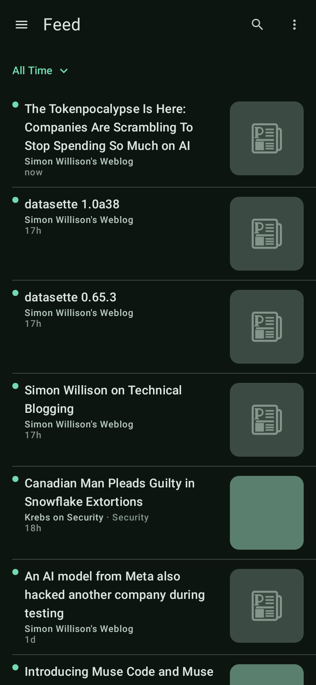
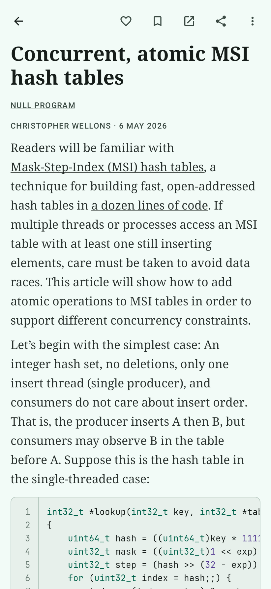
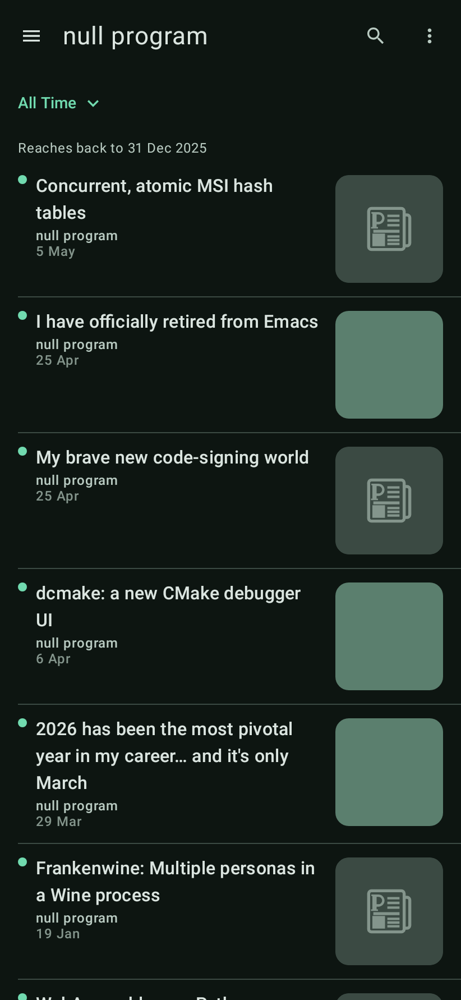
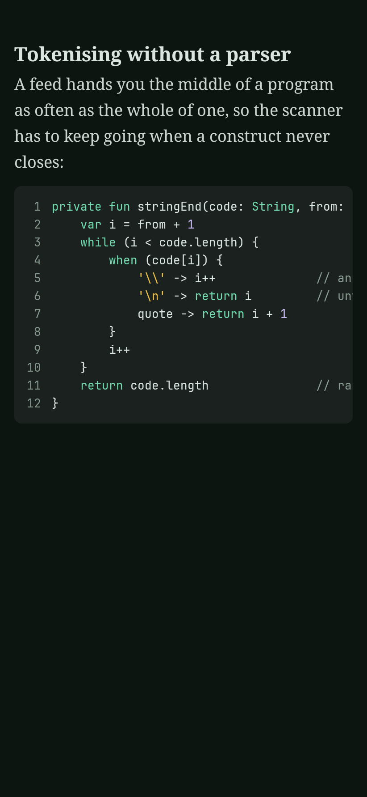
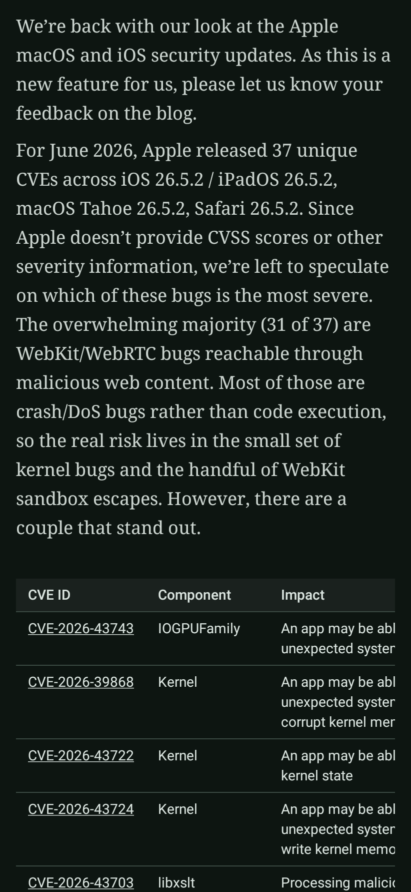
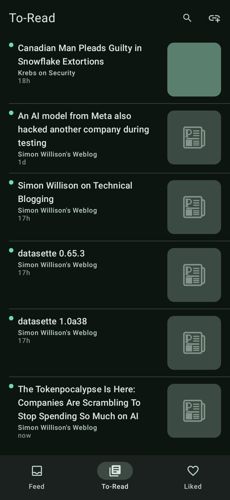

<p align="center">
  
</p>

<p align="center">
  A local-first RSS reader for Android — no account, no server, no sync, no analytics.
</p>

<p align="center">
  
  
  
  
  
  
</p>

## What Perch is

An RSS reader that keeps everything on your phone. Your sources, folders and what you have
read, liked and saved live in a database on the device and go nowhere else — the only network
calls Perch makes are to the feeds you added.

Grab the APK from the [latest release](https://github.com/michaelawetahegn/Perch/releases/latest)
and `adb install -r perch-*.apk`, or open it on the phone. minSdk is 26 (Android 8.0). Releases
install over each other and keep your read state, likes and to-read queue — bar the first,
debug-signed build, whose one-time crossing its own release page explains.

## What it does

**Sources.** Paste a feed URL *or* a site's homepage — Perch resolves the homepage via `<link
rel="alternate">`, then the conventional paths (`/feed`, `/rss.xml`, …), and shows you what it
found first. RSS 2.0/0.9x, Atom 1.0 and RSS 1.0 (RDF). Folders, multi-select delete, OPML.

**One Feed.** Every source in a single stream, newest first, over a window you pick — Past 24
Hours through All Time, each measured back from right now, not from a midnight. Each row says
who published it, in what category, and when. Tap the source name in an article's byline —
or pick it in the drawer — to narrow the Feed to that source alone.

**Reading.** Native Compose, not a WebView: paragraphs, headings, lists, quotes, tables with
real rules, pinch-zoom images, and code blocks that scroll horizontally, syntax-highlighted in a
dozen languages behind a pinned line-number gutter that never lands in what you copy. Feed HTML
is sanitized against an allowlist on the way *into* the database.

**Full text.** When a feed ships a headline and a link, Perch fetches the page and runs a
Readability-style extraction over it, through the same sanitizer as everything else — on open,
never on refresh, never replacing text with less text. *Load full article* forces it.

**Keeping.** Three independent flags per entry — read, **liked** and **saved for later** —
each with its own destination in the bottom bar, each surviving a refresh and a reinstall.
Saved and Liked ignore the time window. Share an article from its toolbar or from a row's
long-press sheet; *Copy link* sits beside it in both. A profile export writes folders, sources and every
flag to one JSON file; importing it merges and is idempotent.

**Quietly.** Conditional GET (`ETag` / `If-Modified-Since`), so a quiet feed costs a 304 and
nothing else. Background refresh on an interval you set, network-constrained, via WorkManager.
Paged lists. Material 3 in light and dark from one seed colour. Entries dedupe on `(feedId,
guid)`; a refresh never resurrects something you have read.

## Build

Requires **JDK 17** (Temurin) and the Android SDK (compileSdk 35, build-tools 35.0.0).

```sh
export JAVA_HOME=/path/to/jdk-17
echo "sdk.dir=/path/to/Android/Sdk" > local.properties
./gradlew assembleDebug     # → app/build/outputs/apk/debug/app-debug.apk
./gradlew test              # full unit + Robolectric suite, offline and deterministic
```

`./gradlew test` needs no emulator and no network. `assembleRelease` signs with
`~/.perch/signing.properties` if present and debug-signs if not, so a clean clone still builds.

## Adding a feature

Find its layer below, write the failing test beside the code it covers, then run the narrowest
task — `./gradlew :app:testDebugUnitTest --tests '*YourTest*'` — before the full suite. Parser
work answers to `fixtures/`: 39 feeds, 4 homepages and 23 article pages the corpus tests hold as
a standing contract. Add a fixture; never weaken a test.

```
app/src/main/java/dev/mkiros/perch/
  data/parse/    feed parsers, HTML sanitizer, article-block lowering
  data/extract/  Readability-style full-text extraction over jsoup
  data/db/       Room entities, DAOs, migrations
  data/net/      OkHttp fetcher, conditional GET, connectivity
  data/repo/     FeedRepository — fetch → parse → sanitize → store
  work/          RefreshWorker
  ui/            Compose screens, theme, brand, navigation
fixtures/        harvested feed, homepage and article corpus (the test contract)
```

[`SPEC.md`](SPEC.md) pins the toolchain and the behavioural rules, [`DESIGN.md`](DESIGN.md) is
the visual spec, the `PLAN-*.md` at the repository root is what is being built next, and
`docs/RELEASE-NOTES.md` is how a release page gets written.

## How it is built

Perch is written by an unattended loop of Claude Code sessions: `loop.sh` runs one session per
checkbox task in the plan file, each starting with no memory of the last, doing one task,
verifying it, committing, and exiting — the file on disk is the memory, which is what lets the
work survive a session ending. [`docs/RALPH.md`](docs/RALPH.md) is the whole process; finished
plans are archived in [`docs/plans/`](docs/plans/).

## Licence

MIT — see [LICENSE](LICENSE).

The contents of `fixtures/` are captured copies of third-party feeds and web pages, retained
solely as test data; they remain the property of their respective publishers.
