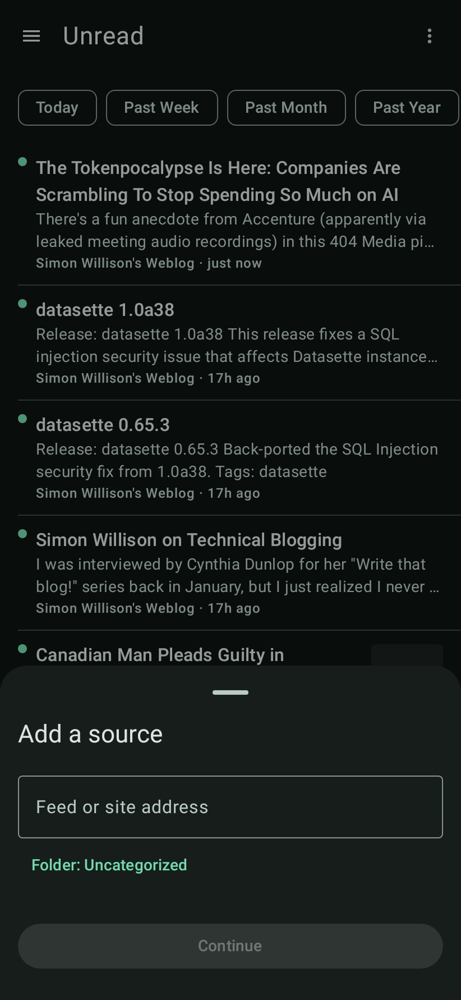

# Perch

A local-first RSS reader for Android. No account, no server, no sync, no analytics,
no crash reporting. Every feed is fetched straight from its publisher over HTTPS and
every byte of state — sources, entries, read marks — lives in a Room database on the
phone.

Perch exists because the good readers all became services. This one is a client.

<p align="center">
  
  
  
  
</p>

## v0.1 features

**Sources**

- Add a source by pasting anything — a feed URL, or a site's homepage. Perch resolves
  the homepage to its feed by `<link rel="alternate">`, then by the conventional paths
  (`/feed`, `/rss.xml`, `/atom.xml`, …), and confirms what it found before committing.
- RSS 2.0/0.9x, Atom 1.0, and RSS 1.0 (RDF) — dispatched on the document root, not on
  the file extension or the `Content-Type`.
- Rename and remove sources; OPML import and export through the system file picker.

**Reading**

- One unified unread list, newest first, or filtered to a single source from the drawer,
  which carries per-source unread counts.
- A reader view that renders entry content as native Compose — paragraphs, headings,
  lists, block quotes, code blocks that scroll horizontally instead of wrapping, tables,
  images, and rules. No WebView.
- Feed HTML is sanitized against an allowlist on the way into the database, so nothing
  downstream of storage ever sees publisher markup.
- Pull to refresh, mark-all-read with an undo snackbar, and offline / fetch-failure
  states surfaced in a banner rather than as an empty screen.

**Under the hood**

- Conditional GET (`ETag` / `If-Modified-Since`) on every refresh, so a quiet feed costs
  a 304 and nothing else.
- Background refresh on a user-set interval via WorkManager, network-constrained.
- Material 3, light and dark, with the whole palette derived from one seed colour.
- Entries dedupe on `(feedId, guid)`, and a refresh preserves read state — re-fetching
  a feed never resurrects something you have already read.

## Build

Requires **JDK 17** (Temurin) and the Android SDK (compileSdk 35, build-tools 35.0.0).

```sh
export JAVA_HOME=/path/to/jdk-17
echo "sdk.dir=/path/to/Android/Sdk" > local.properties
./gradlew assembleDebug     # → app/build/outputs/apk/debug/app-debug.apk
./gradlew test              # full unit + Robolectric suite, offline and deterministic
```

`./gradlew test` needs no emulator and no network. The parser, storage, repository,
worker, and most of the UI are covered by JVM and Robolectric tests; `fixtures/`
holds 39 real feed snapshots that the parser corpus test runs against as a standing
contract.

minSdk is 26 (Android 8.0). Install the APK with `adb install -r`.

## Layout

```
app/src/main/java/dev/mkiros/perch/
  data/parse/    feed parsers, HTML sanitizer, article-block lowering
  data/db/       Room entities, DAOs, migrations
  data/net/      OkHttp fetcher, conditional GET, connectivity
  data/repo/     FeedRepository — fetch → parse → sanitize → store
  work/          RefreshWorker
  ui/            Compose screens, theme, navigation
fixtures/        harvested feed + homepage corpus (the parser test contract)
maestro/         end-to-end regression flow
```

`SPEC.md` pins the toolchain and the behavioural rules; `DESIGN.md` is the visual spec.

## Status

v0.1.0 is the first working build — sideloaded, debug-signed, and in daily use.
v0.2 is in progress: folders, a read-later queue, thumbnails, full-text extraction for
feeds that ship links only, syntax-highlighted code, and a tap-to-zoom image viewer.

## Licence

MIT — see [LICENSE](LICENSE).

The contents of `fixtures/` are captured copies of third-party feeds and web pages,
retained solely as test data; they remain the property of their respective publishers.
