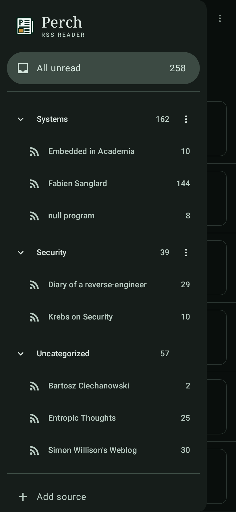

<p align="center">
  
</p>

<p align="center">
  A local-first RSS reader for Android — no account, no server, no sync, no analytics.
</p>

<p align="center">
  
  
  
  
</p>

## Install

Grab the APK from [Releases](https://github.com/michaelawetahegn/Perch/releases) and
`adb install -r perch-*.apk`, or open it on the phone. minSdk is 26 (Android 8.0).

> v0.1.0 is **debug-signed**. Updating from it to v0.2.0 needs an uninstall first;
> v0.2.0 onward is signed with a stable release key and updates in place, keeping your
> read state, likes and to-read queue.

## What it does

**Sources.** Paste anything — a feed URL or a site's homepage. Perch resolves the
homepage to its feed via `<link rel="alternate">`, then the conventional paths
(`/feed`, `/rss.xml`, `/atom.xml`, …), and shows you what it found before committing.
RSS 2.0/0.9x, Atom 1.0 and RSS 1.0 (RDF), dispatched on the document root rather than
on a file extension. Sources live in folders; long-press the drawer to select and
delete several at once. OPML in and out through the system file picker.

**Reading.** One unread list across every source, sectioned by folder and filtered to
a time range you pick — Today through All Time. Entries render as native Compose, not
a WebView: paragraphs, headings, lists, block quotes, tables, images, and code blocks
that scroll horizontally instead of wrapping. Feed HTML is sanitized against an
allowlist on the way *into* the database, so nothing downstream ever sees publisher
markup.

**Keeping.** Three independent flags per entry — read, **liked**, and **saved for
later** — each with its own destination in the bottom bar, each surviving a refresh
and a reinstall. Saved and Liked ignore the time filter, because a to-read list that
hides last month's articles is not a to-read list.

**Quietly.** Conditional GET (`ETag` / `If-Modified-Since`) on every refresh, so a
quiet feed costs a 304 and nothing else. Background refresh on an interval you set,
network-constrained, via WorkManager. Material 3 in light and dark, the whole palette
derived from one seed colour. Entries dedupe on `(feedId, guid)` and a refresh never
resurrects something you have already read.

## Build

Requires **JDK 17** (Temurin) and the Android SDK (compileSdk 35, build-tools 35.0.0).

```sh
export JAVA_HOME=/path/to/jdk-17
echo "sdk.dir=/path/to/Android/Sdk" > local.properties
./gradlew assembleDebug     # → app/build/outputs/apk/debug/app-debug.apk
./gradlew test              # full unit + Robolectric suite, offline and deterministic
```

`./gradlew test` needs no emulator and no network. The parser, storage, repository,
worker and most of the UI are covered by JVM and Robolectric tests; `fixtures/` holds
39 real feed snapshots the parser corpus test runs against as a standing contract.

`assembleRelease` signs with `~/.perch/signing.properties` if it is present and falls
back to debug signing with a warning if it is not, so a clean clone still builds.

## Layout

```
app/src/main/java/dev/mkiros/perch/
  data/parse/    feed parsers, HTML sanitizer, article-block lowering
  data/db/       Room entities, DAOs, migrations
  data/net/      OkHttp fetcher, conditional GET, connectivity
  data/repo/     FeedRepository — fetch → parse → sanitize → store
  work/          RefreshWorker
  ui/            Compose screens, theme, brand, navigation
design/brand/    the Perch mark; redrawn as vector paths in ui/theme/Brand.kt
fixtures/        harvested feed + homepage corpus (the parser test contract)
maestro/         end-to-end regression flow
```

`SPEC.md` pins the toolchain and the behavioural rules, `DESIGN.md` is the visual spec,
and `PLAN-2.md` is what is being built next.

## Status

v0.1.0 shipped and is in daily use. v0.2 is in progress: folders, the read-later queue
and the bottom bar are done; still to come are thumbnails, full-text extraction for
feeds that ship links only, syntax-highlighted code, real tables, and a tap-to-zoom
image viewer.

## Licence

MIT — see [LICENSE](LICENSE).

The contents of `fixtures/` are captured copies of third-party feeds and web pages,
retained solely as test data; they remain the property of their respective publishers.
